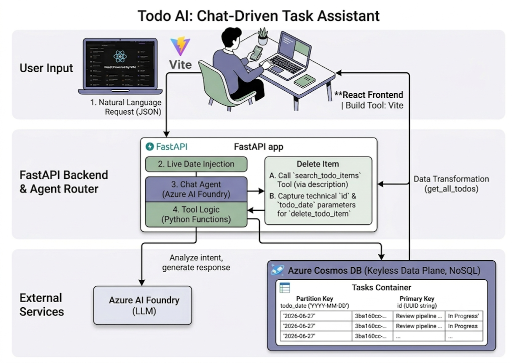

---

# Todo AI: Chat-Driven Task Assistant

Todo AI is a simple, minimalist web application that lets you manage your daily to-do list entirely through a chat interface. Instead of manually clicking buttons, typing into forms, or checking boxes, you simply tell the assistant what you want to do, and it handles your list for you.

---

## 💡 How It Works

The app features a clean, side-by-side view designed to keep your day focused:

* **The To-Do List (Left Side):** A clean display showing your tasks for the day. Completed tasks are neatly marked with a soft sage green badge, and active tasks show up in a soft indigo badge.
* **The Chat Assistant (Right Side):** A simple chat panel. You type naturally—like *"Add buy groceries for tonight"* or *"Delete my python coding task"*—and the assistant instantly updates your list on the left.

---

## ⚙️ The Tech Stack Behind It

To make this conversational experience work smoothly, the app connects three main components:

1. **The Frontend (React & Tailwind):** The visual interface you see and type into.
2. **The Backend API (FastAPI & Python):** The bridge that receives your chat messages, reads the time, and talks to the AI.
3. **The Database (Azure Cosmos DB):** A secure cloud database where your tasks are permanently saved so they don't disappear when you refresh the page.

---

## Architecture

---

## 🍿 Enjoy

<video controls src="Screen Recording 2026-06-27 at 1.58.17 PM.mov" title="Title"></video>